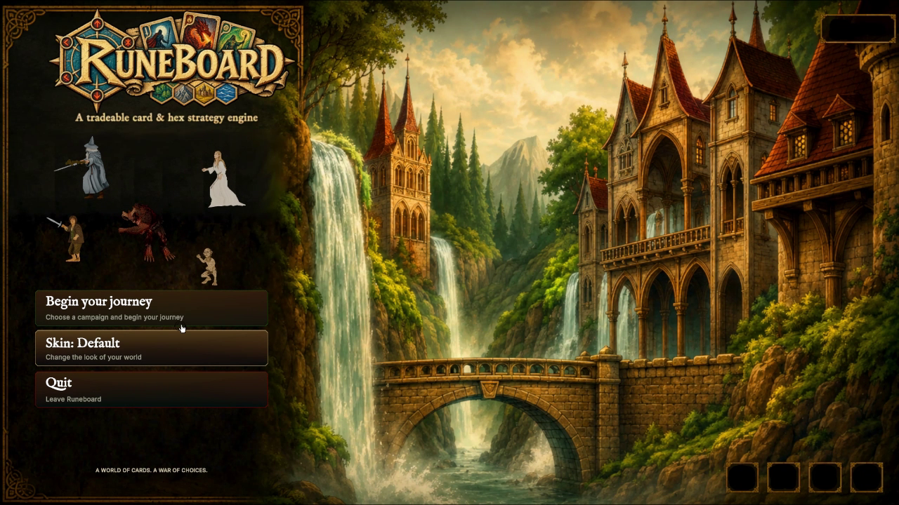
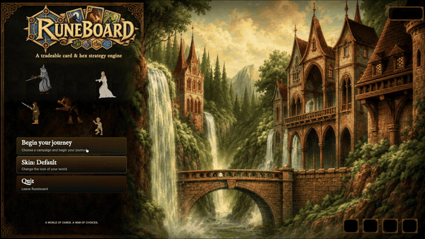
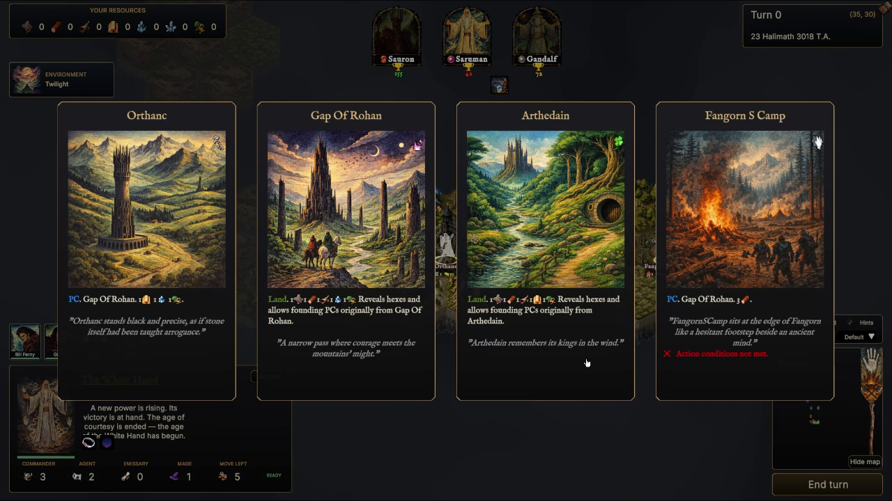
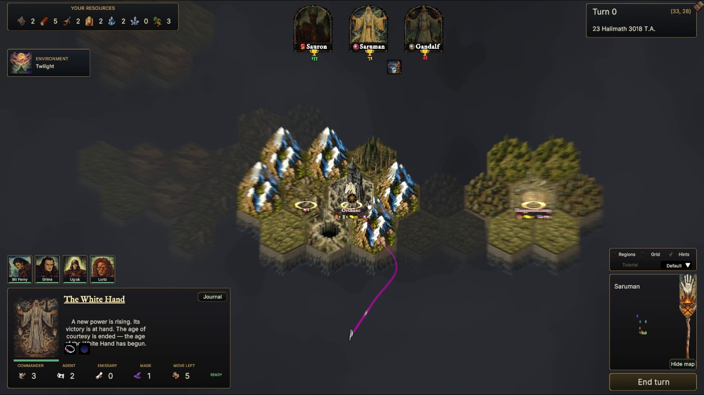
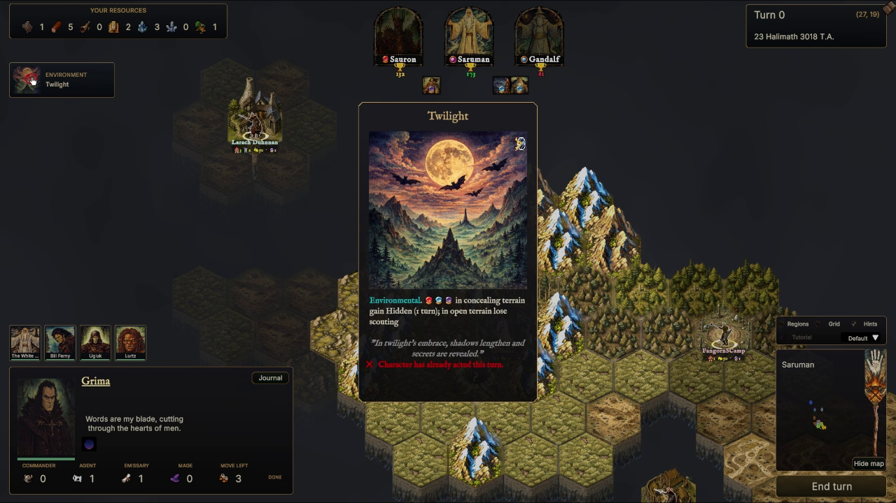
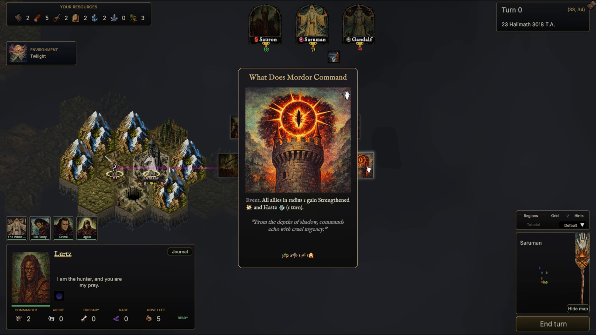
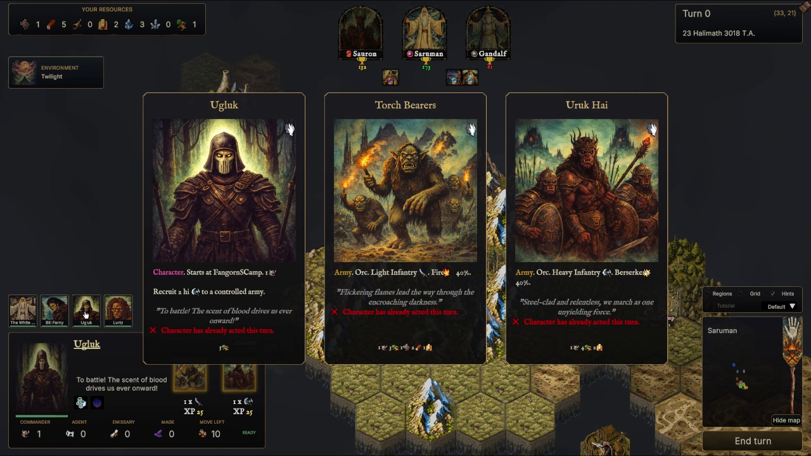
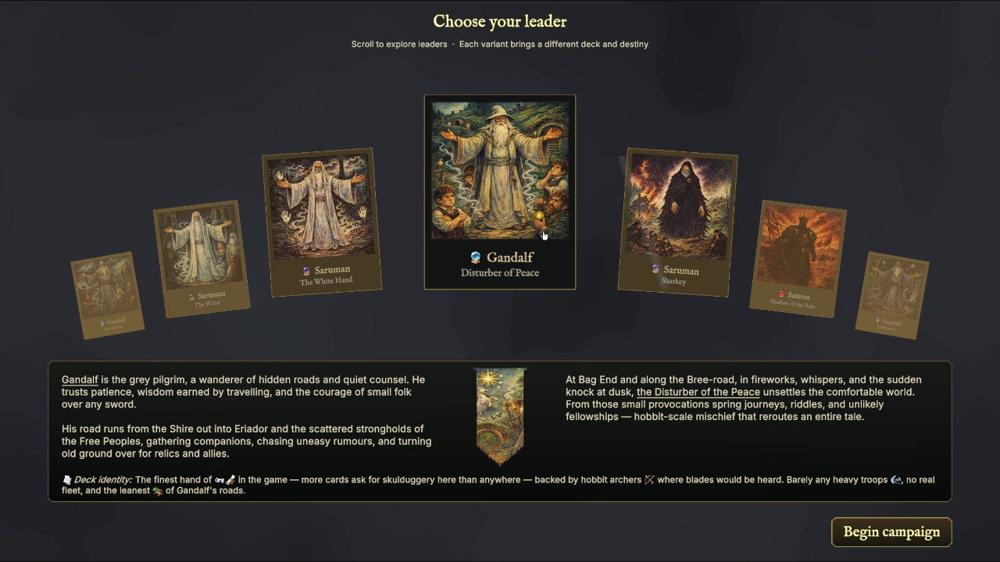

Click the preview above to watch the full trailer.

# Runeboard

*A dark, hex &amp; card-driven strategy game of armies, alliances, and ancient powers across Middle-earth.*

[**Website**](https://josejuanmartinez.github.io/Runeboard/) · [**Download**](https://github.com/josejuanmartinez/Runeboard/releases) · [**Dev Diary: The AI**](https://medium.com/@jjmcarrascosa/field-notes-dev-diary-on-video-games-ai-and-some-generative-ai-9d435055ae3f?postPublishedType=repub)

---

## Strategy with the soul of an old fantasy table

Runeboard brings a sweeping conflict to a living hex map. Muster distinct armies, guide legendary characters, claim strongholds, and play illustrated cards that can turn a desperate battle.

Every campaign grows from competing powers and shifting fronts. Roads, rivers, mountains, and hidden lands shape the choices before you — and the story left behind.

## Three fronts, one fate

<table>
<tr>
<td align="center" width="33%">
 
<b>The Free Peoples</b> 
Rally scattered realms and stand against the gathering dark.
</td>
<td align="center" width="33%">
 
<b>The Dark Lord</b> 
Unleash vast hosts and break the strongholds of the Free People.
</td>
<td align="center" width="33%">
 
<b>Neutral Nations</b> 
Scheme, industrialize, and strike where rival powers are weakest.
</td>
</tr>
</table>

## Every move writes history

- **Shape your armies** — Recruit troops, combine forces, and march commanders across a dangerous world.
- **Play the moment** — Build a deck around your power and answer the battlefield with characters, actions, spells, and events.
- **Outthink rival powers** — Read the terrain, defend vital routes, and pursue objectives before the age turns against you.

## Take command of your campaign

1. **Pick a scenario** — From the classic random earth of *Champions of Middle Earth* to the authored 2950 T.A. story of *The Untold War of the Ring*.
2. **Browse the company** — Cycle through available leaders (Gandalf, Saruman, Sauron, and their many flavours), each with its own deck identity.
3. **Confirm your choice** — Start the campaign as that leader, with your capital, characters, and starting resources laid out on the hex map. Fog of war hides the rest of Middle-earth until you explore it.

Every character doubles as a card — hover a leader's name to see their full stats and portrait, or an underlined army name to see its card. Move hex by hex with the arrow keys or WASD; spotted enemies are traced in red, spotted neutrals in grey.

 
Orthanc, the Gap of Rohan, Arthedain, Fangorn's Camp — every place is a card too

## Gallery

<table>
<tr>
<td></td>
<td></td>
</tr>
<tr>
<td></td>
<td></td>
</tr>
<tr>
<td></td>
<td></td>
</tr>
</table>

## AI

Runeboard's nations and characters are driven by a layered AI stack, [written up in detail here](https://medium.com/@jjmcarrascosa/field-notes-dev-diary-on-video-games-ai-and-some-generative-ai-9d435055ae3f?postPublishedType=repub):

| | |
|---|---|
| **Utility AI** | All nations score danger, opportunity, growth, and stagnation to weigh their options. |
| **Blackboards** | Store the situation of the world, and register/remember nation and character missions. |
| **Hierarchical Task Network** | Plans tasks for characters, decomposing them into specific possible behaviours. |
| **Behaviour / State Trees** | Execute behaviours depending on Utility AI scores and feasibility. |
| **Neural Network** | An MLP trained on supervised best strategies, consulted alongside the rest of the stack. |

 
Utility AI scores, stored in Blackboards, are evaluated; tasks are planned and executed by (State) Behaviour Trees

## The art

Runeboard's retro illustration style started on paper, not in a prompt box:

1. Scanned old black & white illustrations from old RPG books.
2. Redrew and repainted some of them for a unique retro feeling.
3. Hand-painted 25 of them using colour schemes and techniques from the 80s.
4. Trained a LoRA on an open-source, open-weight Qwen Image model.
5. Queried that model — trained on the original art — to generate the game's cards.

Hexes started as assets from the [Unity Asset Store](https://assetstore.unity.com/packages/2d/environments/hex-medieval-fantasy-locations-59271), repainted by hand.

---

An independent, non-commercial fan project inspired by classic fantasy strategy games.

[Website](https://josejuanmartinez.github.io/Runeboard/) · [Releases](https://github.com/josejuanmartinez/Runeboard/releases)

